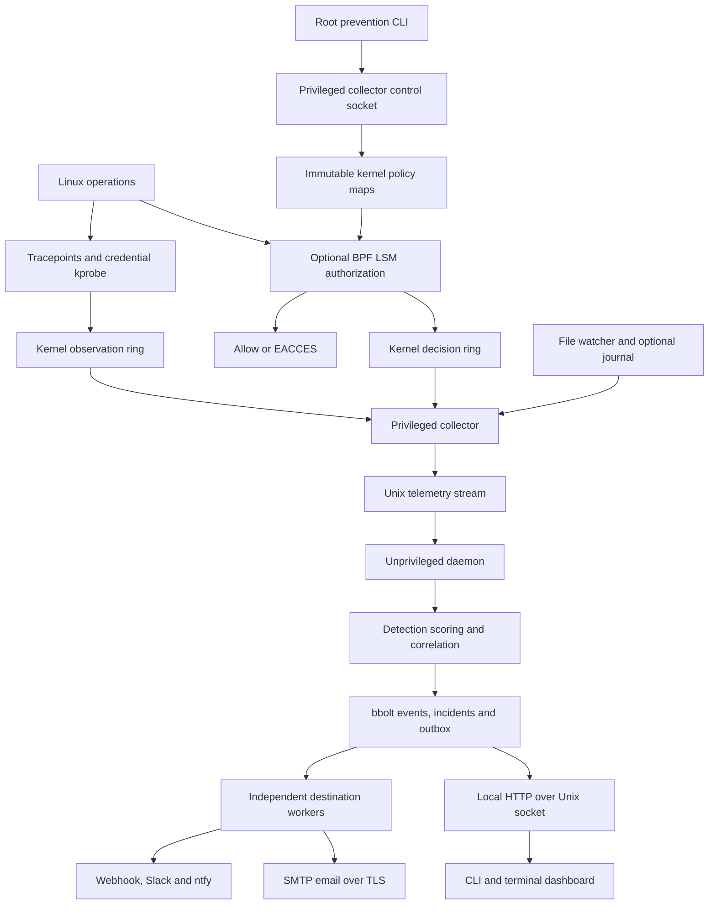

# Architecture

RINLock is a single-host Linux amd64 agent. It combines low-level observations
with explicit detection rules and a separate kernel authorization policy. It
does not require a central server, Kubernetes or an external malware database.

## Collection

`bpf/sensor.bpf.c` uses raw syscall entry/exit for open/connect observations,
successful execution tracepoints, process-exit cleanup and `commit_creds` for
effective-UID transitions. Versioned binary records travel through a 16 MiB ring.
A per-thread pending map joins entry and exit. Per-CPU counters expose event loss.
The decoder rejects incompatible records instead of guessing their layout.

Kernel boot ID, PID and process start time distinguish process lifetimes despite
PID reuse. Parent start times support observed ancestry. Device/inode identities
identify observed filesystem objects. `/proc` enrichment is best effort and
guarded against process/file replacement; command names alone are not identity.

The filesystem watcher combines inotify with periodic metadata reconciliation.
It detects changes to selected literal paths and diffs local account records.
It does not attribute those changes to a process. Optional journal parsing
recognizes common English SSH/PAM messages; it is not universal login coverage.

## Detection and persistence

The daemon uses a bounded ingestion queue. The detection service evaluates a
normalized, revisioned policy, then stores the event, incident changes, cooldown
state and notification enqueue decision in a transaction. Policy activation and
ingestion are serialized so every stored event identifies the policy used.

Scores are explainable priorities from 0 to 100. The highest matching rule wins
the score; all matching explanations remain. Correlation maintains bounded
windows for web-shell-to-credential/egress chains and repeated login failures.
Incidents have separate scores, evidence IDs and review history. New evidence
reopens a resolved incident. Replay evaluates individual stored events with a
candidate detection policy and does not send notifications.

bbolt has one writer. Retention preserves events required by pending delivery
or retained incident evidence. Cleanup frees pages for reuse; offline compaction
creates a verified new database copy and never replaces the original. Storage
errors stop the daemon rather than silently continuing without persistence.

## Notification delivery

Each configured destination has a worker that reserves attempts before network
I/O. The transaction records matching destination IDs alongside independent
delivery IDs, so one failed service does not block another. The persistent outbox
survives restart and supports stable idempotency keys, bounded attempts, cooldown,
per-destination rate limits, a shared queue limit, retries and failure history.
HTTP receivers should deduplicate keys; SMTP uses a stable Message-ID, but neither
transport guarantees exactly-once delivery. No kernel operation waits on HTTP,
SMTP or database persistence. See [notification configuration](notifications.md).

## Privilege boundary and prevention

Packaged deployment separates root collection from the `rinlock` daemon account.
Both ends authenticate telemetry peers using `SO_PEERCRED`. The telemetry stream
carries observations and health only. Prevention uses a separate control socket:
root can mutate policies, the telemetry user can read them. Detection policy
reload cannot change prevention rules.

`bpf/prevention.bpf.c` attaches to `file_open`, `bprm_check_security` and
`socket_connect`. It evaluates one immutable policy map per decision and preserves
prior LSM denial. Root publishes replacements by one map-in-map update. Matching
decisions contain their own prevention revision, distinct from the detection
revision later attached by the daemon. A full audit ring never changes a deny.

Prevention stays attached when the daemon disconnects, but detaches if the
collector exits. Runtime updates reset to the startup file on collector restart.
See the [prevention guide](prevention.md) for exact semantics and coverage limits.

## Source map

- `cmd/rinlock`: command parsing and orchestration.
- `bpf`, `internal/sensor`: kernel collection, decoding, metadata and watcher sources.
- `internal/prevention`: authorization policies, BPF loading and root controls.
- `internal/relay`, `internal/unixpeer`: authenticated local transport.
- `internal/daemon`: lifecycle, queues and maintenance.
- `internal/policy`, `internal/detection`: matching, scoring and policy revisions.
- `internal/store`: events, correlation, review state, outbox and retention.
- `internal/notify`: webhook, Slack, ntfy and SMTP adapters, configuration and retries.
- `internal/api`, `internal/tui`: local operations and dashboard.

## Optional advisory scanning worker

A daemon-side userspace worker invokes the separately installed Trivy executable
on fixed local targets, syncs cached advisories and CISA KEV, and commits scan
baselines with scored change events and their notification outbox in one transaction.
The CLI and sixth TUI tab use the existing Unix API. Scanner failures retain previous
results and do not stop runtime collection. This stage does not join package findings
to live process identities or automatically enforce CVE mitigations. See
[vulnerability scanning](vulnerabilities.md) for bounds and coverage.
