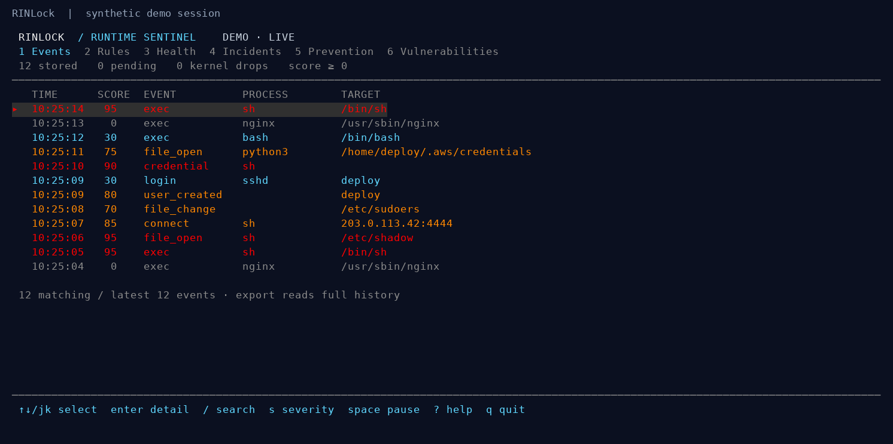
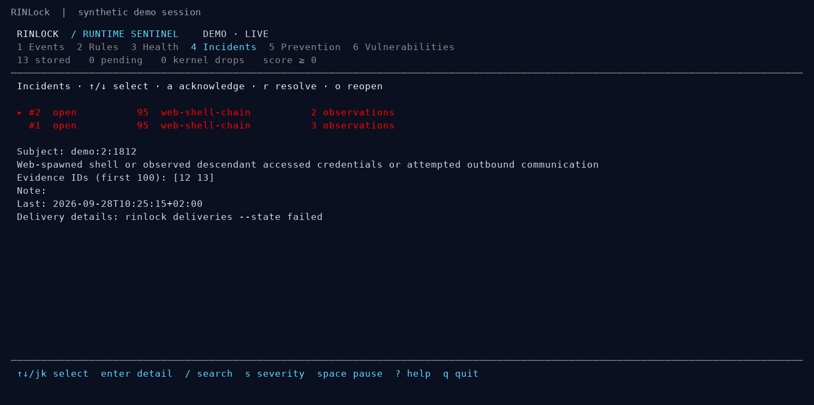
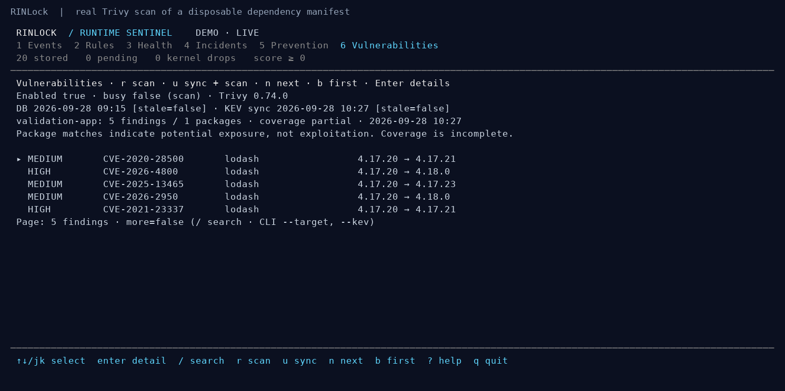

# RINLock

**Linux runtime intrusion detection and opt-in eBPF prevention.**

Observe process execution, credential access, outbound connections, file changes,
accounts and login activity. Explain suspicious behavior with rule-based scores,
correlate incidents, retain evidence, and deliver notifications asynchronously.
Use the terminal dashboard to investigate and operate explicit prevention rules.

**Status:** 0.5 development. Native collection and prevention have passed live
container tests on Linux `7.1.9-1-MANJARO`. Installed systemd hardening, other kernels
and extended production workloads still need validation. Prevention is disabled
by default and its [scope and failure behavior](docs/prevention.md) are explicit.

[Documentation website](https://merl111.github.io/RINLock-docs/) ·
[Agent docs](docs/agents.md) · [llms.txt](https://merl111.github.io/RINLock-docs/llms.txt) ·
[Local guides](docs/index.md) · [Configuration](docs/configuration.md) ·
[Prevention](docs/prevention.md) · [Vulnerabilities](docs/vulnerabilities.md) · [Operations](docs/stage-3.md) ·
[Releases](docs/releasing.md) · [Security](SECURITY.md)

## Try the dashboard

Build requirements: Linux amd64, Go 1.24+, Clang with a BPF backend, Linux
development headers, and libbpf headers. On Debian/Ubuntu the native build packages
are `clang`, `libbpf-dev`, and `linux-libc-dev`; install a suitable Go version too.

```sh
make build
./bin/rinlock demo
```

The demo uses synthetic events, a temporary database and a real running dashboard.
It does not load BPF, monitor the host or send webhooks. Closing it cleans up its
own daemon and temporary files.





Screenshots are captured from the application using
[`scripts/screenshots.py`](https://github.com/merl111/RINLock/blob/5a341d1c8e10c997aa7c32d8f643a86d26005dcd/scripts/screenshots.py), with synthetic fixtures.

## What it does

- **Behavioral detection:** web-server shells, unexpected credential-file opens,
  effective-UID escalation, suspicious egress and configurable event rules.
- **More host events:** watched file metadata/content-change notifications, local
  account changes, and optional SSH/PAM journal observations.
- **Evidence and incidents:** versioned event identities, explainable scores,
  correlated activity, review notes and automatic reopening on new evidence.
- **Async notifications:** durable webhook outbox, cooldowns, retries, rate limits,
  pause controls, failure history and manual requeue.
- **Operations:** separate privileged collector and unprivileged daemon, health
  and loss reporting, retention, capacity admission checks and offline compaction.
- **Optional vulnerability scans:** cached Trivy advisories, CISA KEV enrichment,
  persistent findings, change alerts and a terminal dashboard tab.
- **Optional prevention:** kernel authorization for execution, file opens and
  IPv4/IPv6 connection attempts, with audit/enforce/disabled modes and root controls.

Scores are priorities, not probabilities. Kernel observations, path aliases and
source coverage have limits; see [architecture](docs/architecture.md) and
[security](SECURITY.md).

## Check known vulnerabilities

Install Trivy separately, edit [the scanner configuration](configs/vulnerabilities-example.json)
with explicit local targets, and start the daemon with `--vulnerability-config FILE`.
Press **6** in the terminal dashboard to inspect findings; **r** scans and **u** updates
advisories and rescans. Scanning is disabled by default.

```sh
./bin/rinlock vulnerabilities --action status
./bin/rinlock vulnerabilities --action scan
./bin/rinlock vulnerabilities --kev
```



Findings indicate potential exposure, not proof of compromise. Coverage, feed freshness
and scan failures are visible. See [setup, coverage and notification behavior](docs/vulnerabilities.md).

## Define detection rules

```sh
./bin/rinlock init-config > rules.json
./bin/rinlock check --config rules.json
```

A custom rule can flag selected changes to a watched file:

```json
{
  "id": "sudoers-permissions",
  "description": "Sudoers permissions or ownership changed",
  "kinds": ["file_change"],
  "paths": ["/etc/sudoers"],
  "changes": ["mode", "uid", "gid"],
  "score": 95
}
```

Add it to the `rules` array and include the file in `watch_files`. Rules use AND
between fields and OR within lists. See the [complete reference](docs/configuration.md)
and [custom examples](configs/custom-events.json).

For persistent synthetic exploration, run separate processes:

```sh
./bin/rinlock serve --demo --db ./data/events.db --socket ./data/rinlock.sock
# Another terminal:
./bin/rinlock dashboard --socket ./data/rinlock.sock
```

## Deploy on Linux

```sh
make package
python3 scripts/check-package.py
```

The archive includes a static binary, both BPF objects, configuration examples,
installer, systemd units and documentation. Installation does not enable services
or prevention. Follow the [deployment guide](docs/stage-3.md) for the `rinlock`
service account, protected sockets, webhook environment and operational checks.

For development, `sudo ./bin/rinlock doctor --probe` tests native attachments.
Production collection uses the separate root collector and unprivileged daemon.
Do not expose their Unix APIs as unauthenticated network services.

## Enable prevention deliberately

Prevention has its own policy file and root-only control path. Detection scoring
never enables blocking. Start with [the audit example](configs/prevention-example.json),
replace its workload/paths/network, and validate it:

```sh
./bin/rinlock prevention --check --config my-prevention.json
sudo ./bin/rinlock doctor --prevention --probe
```

After starting the collector with `--prevention-config` as described in
[the prevention guide](docs/prevention.md):

```sh
rinlock prevention
sudo rinlock prevention --rule web-no-shadow --mode enforce
sudo rinlock prevention --disable
```

Dashboard tab **5 Prevention** provides the same rule controls. Decisions execute
inside the kernel; logging and notification delivery happen asynchronously.
Runtime changes reset to the root-owned startup policy when the collector restarts.

## Test and release

```sh
make test
# Rootful Docker on a compatible BPF-LSM host:
DOCKER_HOST=unix:///var/run/docker.sock scripts/test-container.sh
```

The container suite exercises real kernel denial, native collection, reattachment,
audit-buffer overflow and collector/daemon integration. It uses temporary test
cgroups and removes the test container afterwards.

Version tags trigger the [release workflow](https://github.com/merl111/RINLock/blob/5a341d1c8e10c997aa7c32d8f643a86d26005dcd/.github/workflows/release.yml), producing
Linux amd64 binaries, checksums and a corresponding-source archive with dependency
sources/licenses. Major-zero versions are prereleases. See
[testing and release instructions](docs/releasing.md).

## License

RINLock project code is **GPL-2.0-only**, including its eBPF programs. See
[LICENSE](LICENSE). Third-party dependencies retain their upstream licenses.
Contributions follow [CONTRIBUTING.md](CONTRIBUTING.md).
